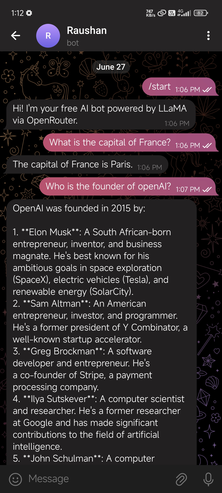
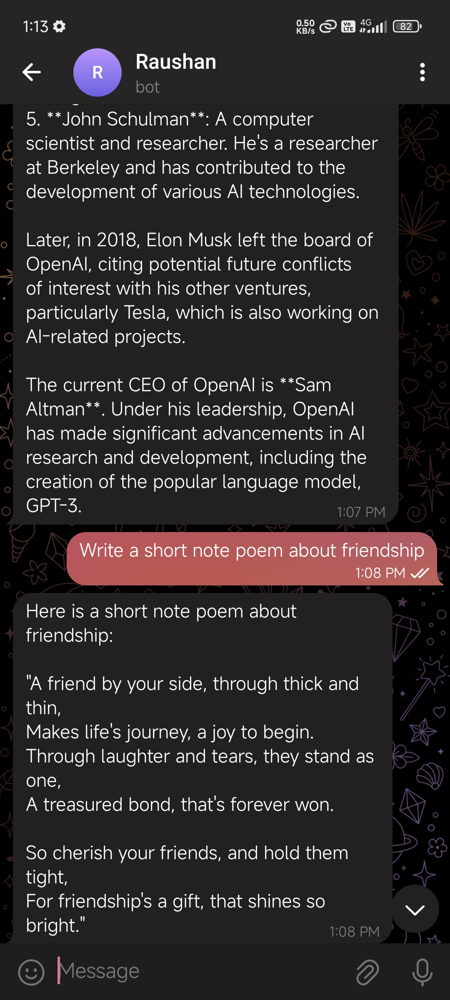

# 🤖 Telegram AI Chatbot (Powered by OpenRouter + LLaMA)

A simple, powerful Telegram AI chatbot built using **Python**, the **python-telegram-bot** library, and **OpenRouter API** (LLaMA model). The bot understands user input and responds intelligently using LLM (Large Language Model) inference.

---

## 🚀 Features

- 🧠 AI-Powered responses (via LLaMA on OpenRouter)
- 🤖 Telegram bot integration
- 🌐 Easy deployment on Replit or locally via VS Code
- ⚙️ Environment variable management using `.env`

---

## 🛠️ Technologies Used

- Python
- [python-telegram-bot](https://python-telegram-bot.org/)
- OpenRouter API
- asyncio
- python-dotenv

---

## 💡 Sample Questions You Can Ask

| Question | Response |
|----------|----------|
| What is the capital of France? | Paris |
| Who is the founder of OpenAI? | Elon Musk, Sam Altman, etc. |
| Write a short poem about friendship. | (Bot responds with a poem) |
| Can you act like a pirate and introduce yourself? | (Bot replies like a pirate) |
| How does ChatGPT work in simple terms? | (Bot explains clearly) |

---

### 🖼️ Demo Screenshots

| Sample Interaction     | Screenshot |
|------------------------|------------|
| Basic Info Q&A         |  |
| Fun Prompt (Pirate)    |  |
| Poem Request           |  |

---

## ⚙️ Setup Instructions

### 1. Clone the Repository

```bash
git clone https://github.com/yourusername/telegram-ai-chatbot.git
cd telegram-ai-chatbot
```

### 2. Install Requirements

```bash
pip install -r requirements.txt
```

### 3. Create a `.env` File

Create a file named `.env` in the root directory and add your keys:

```ini
TELEGRAM_TOKEN=your_telegram_bot_token
OPENROUTER_API_KEY=your_openrouter_key
```

### 4. Run the Bot

```bash
python main.py
```

---

## 🌐 Make It Always Online

- **UptimeRobot:** Add your bot's public web URL (like from Flask server if hosted)
- **Replit:** Use reserved VM or autoscale (Replit Pro)

---

## 📁 Project Structure

```
telegram-ai-chatbot/
├── main.py
├── requirements.txt
├── .env            # (not pushed to GitHub)
├── demo/           # Folder for screenshots
│   ├── demo1.jpg
│   ├── demo2.jpg
│   └── demo3.jpg
└── README.md
```

---

## 📄 License

MIT License

```
MIT License

Copyright (c) 2025 Raushan Kumar

Permission is hereby granted, free of charge, to any person obtaining a copy...
```

---
